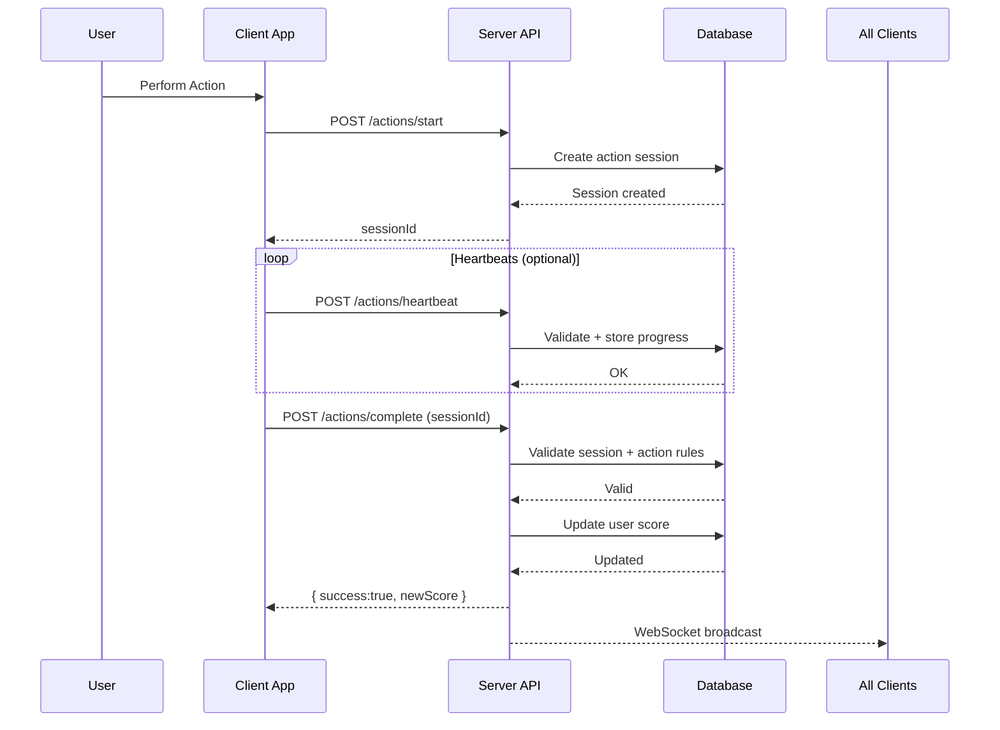

# Score Update Module – Backend Specification

This module provides a secure score–updating mechanism for a scoreboard system where users earn points by completing actions. The module ensures real-time updates, server-side validation, and protection against unauthorized score manipulation.

---

## 1. Overview

The website displays a **Top 10 Scoreboard**, and users earn points after completing certain actions.  
Once an action is completed on the frontend, an API is invoked on the backend to update the user's score.

This module handles:

- Validating the action request
- Verifying the authenticity of the user
- Updating the score securely
- Broadcasting live score updates
- Preventing cheating or unauthorized score increases

---

## 2. API Endpoints

### **POST /actions/start**

Initialize an action session and return a `sessionId`.

### **POST /actions/heartbeat**

Optional. Used for actions requiring tracked duration (e.g., “watch video 30s”).

### **POST /actions/complete**

Validate the action and award points.

### **GET /scores/top**

Return top 10 users' scores.

### **WebSocket /scores/live**

Push live updated scores to all connected clients.

---

## 3. Execution Flow Diagram

---

## 4. Suggested Improvements

- Add anomaly detection (ex: suspiciously fast actions)
- Add cooldown limits for action frequency
- Add signature-based validation to prevent replay attacks
- Use Redis for caching high-frequency score reads
- Add rate limiting
- Add audit logs for security monitoring

---

## Final Notes

- **Do not trust client-provided values.**
- **All reward points must be determined server-side.**
- **Sessions must expire automatically.**
- **Score updates must run in database transactions.**
