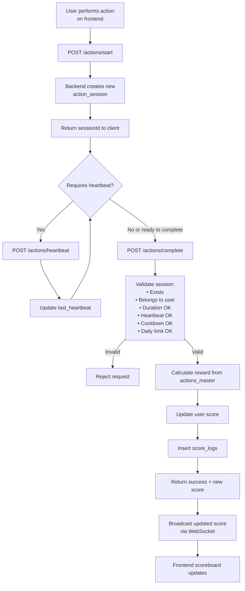

# Problem 6 – Score Update Module Specification

This document defines the backend module responsible for securely updating user scores based on completed actions, ensuring real‑time scoreboard updates and preventing cheating.

---

# 1. Overview

The system includes:

- A public scoreboard showing **Top 10 users**
- Users can perform actions to earn points
- Frontend triggers backend API calls after action completion
- Backend validates, computes, and updates scores securely
- WebSocket broadcasts live score updates to all clients

---

# 2. API Endpoints

### **POST /actions/start**

Start an action session → returns `sessionId`.

### **POST /actions/heartbeat**

(Optional) Required for long‑running actions (e.g., watch video 30s).

### **POST /actions/complete**

Completes an action session and increases the user’s score if valid.

### **GET /scores/top**

Retrieve top 10 users by score.

### **Server-Sent Events /scores/live**

Broadcast score changes in real‑time.

---

# 3. Database Design

## 3.1 ERD (Entity Relationship Diagram)

```
Users (1) ──── (N) ActionSessions (N) ──── (1) ActionsMaster
```

## 3.2 Table Definitions

### **users**

| Field      | Type      | Description     |
| ---------- | --------- | --------------- |
| id         | UUID      | User ID         |
| username   | VARCHAR   | Unique username |
| score      | INT       | Current score   |
| created_at | TIMESTAMP | Timestamp       |

---

### **actions_master**

Configuration for each action type.

| Field              | Type      | Description                  |
| ------------------ | --------- | ---------------------------- |
| action_code        | VARCHAR   | Primary key                  |
| reward_points      | INT       | Points awarded               |
| requires_heartbeat | BOOLEAN   | Requires periodic updates    |
| min_duration       | INT       | Minimum duration (ms)        |
| max_per_day        | INT       | Daily limit                  |
| cooldown_seconds   | INT       | Cooldown before next attempt |
| created_at         | TIMESTAMP | Timestamp                    |

---

### **action_sessions**

Tracks each action attempt.

| Field          | Type      | Description           |
| -------------- | --------- | --------------------- |
| session_id     | UUID      | Primary key           |
| user_id        | UUID      | FK → users            |
| action_code    | VARCHAR   | FK → actions_master   |
| start_time     | TIMESTAMP | Action start time     |
| last_heartbeat | TIMESTAMP | Last heartbeat        |
| completed      | BOOLEAN   | Completed?            |
| completed_at   | TIMESTAMP | Completion time       |
| valid          | BOOLEAN   | Valid/invalid session |
| ip_address     | VARCHAR   | Client IP             |
| user_agent     | TEXT      | Browser agent         |
| created_at     | TIMESTAMP | Timestamp             |

---

### **score_logs**

Audit trail for score changes.

| Field       | Type      | Description   |
| ----------- | --------- | ------------- |
| id          | UUID      | Primary key   |
| user_id     | UUID      | FK → users    |
| action_code | VARCHAR   | Action type   |
| points      | INT       | Points gained |
| timestamp   | TIMESTAMP | Timestamp     |

---

# 4. System Flowchart



---

# 5. Suggested Improvements

- Add anomaly detection for unrealistic user behavior
- Add HMAC signatures to secure session IDs
- Add Redis caching for score ranking
- Add per‑user and global rate limiting
- Add background job for scoreboard recalculation
- Add IP/domain allow‑lists for stricter security

---

# Final Notes

- Never trust client‑submitted points or duration
- All scoring, timing, and validation must be computed server‑side
- Session IDs are single‑use and must expire automatically
- Use transactions for score updates
- Log every score change for audit and fraud detection
